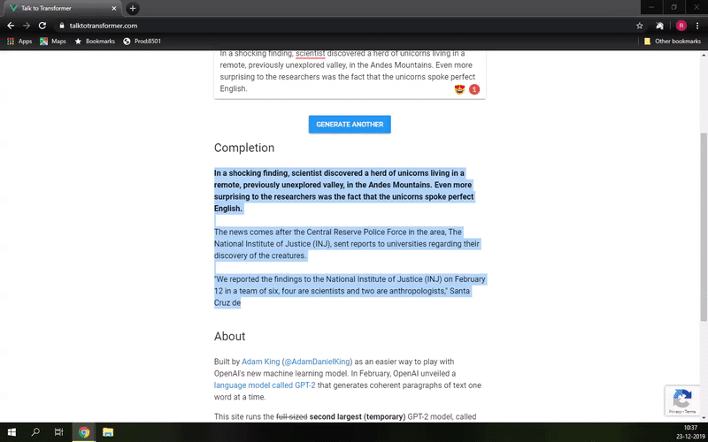
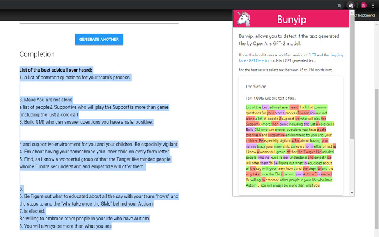
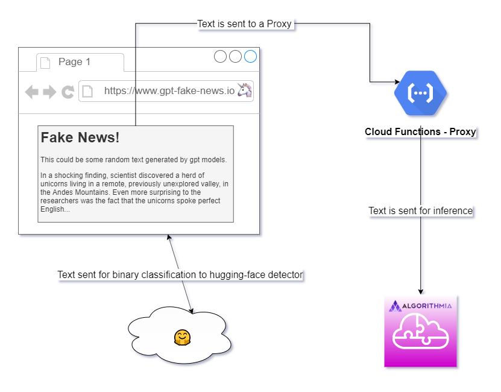
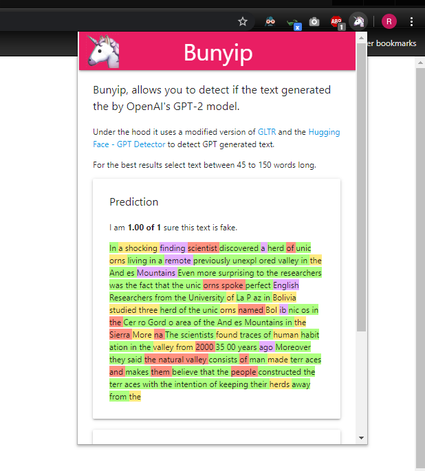
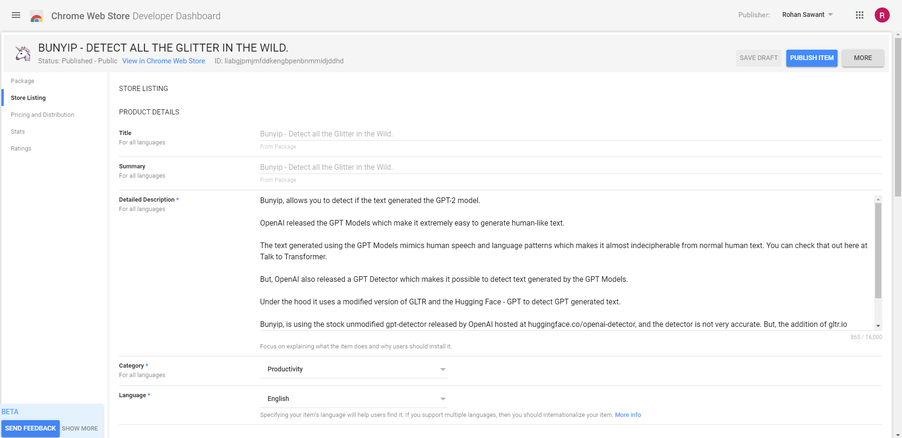
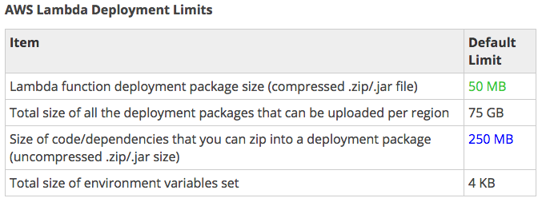
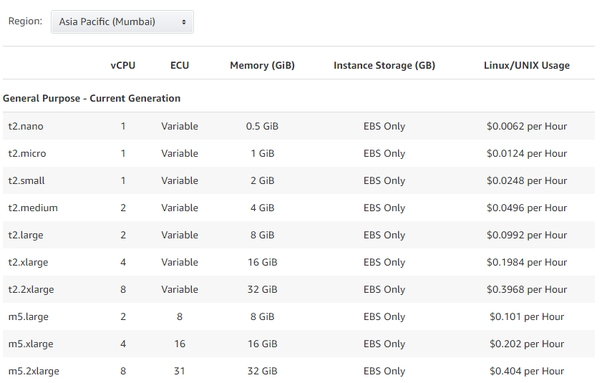
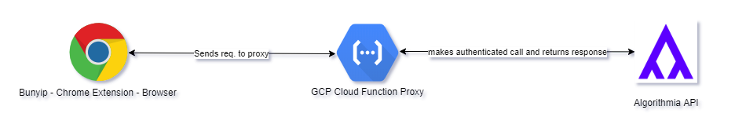
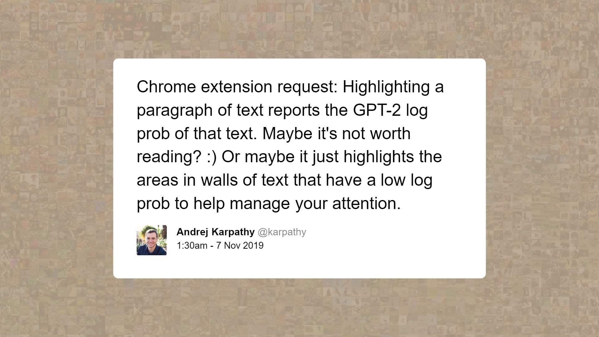
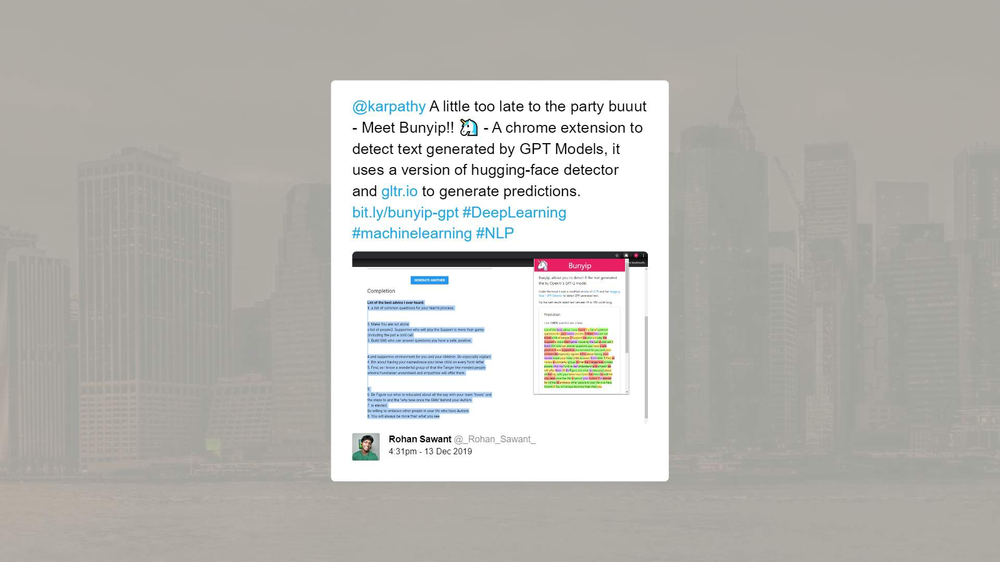

# 🦄 Bunyip - a Chrome Extension to detect AI Generated Text

Bunyip is a Chrome Extension with a Pythonic Serverless Backend, which allows the user to select some text and then predict if the text was generated by OpenAI's GPT Models.

You can install the extension from Chrome Store! -  [Bunyip - Detect all the Glitter in the Wild](https://chrome.google.com/webstore/detail/bunyip-detect-all-the-gli/liabgjpmjmfddkengbpenbnmmidjddhd)

> As with several of my older projects the aim with Bunyip, initially was to monetize it. 
>
> Buut, I could not find a market for this, and for now I decided against making it a paid extension on Chrome Store so I Open Sourced it instead.

## Working

1. The selected text is sent to a Serverless Function for classification
2. The response contains the words with the likelihood of each word being generated by the GPT Model.
3. The extension then visualizes these words, using different words to correspond to different probabilities.

>  This project builds on the [Giant Language Model Test Room](https://github.com/HendrikStrobelt/detecting-fake-text), which enables a forensic analysis of how likely an automatic system has generated a text. - **[Live Demo](http://gltr.io/)**

## Components

There are about 3 components which make up Bunyip.

1. [**Bunyip - Chrome Extension**](https://github.com/CT83/Bunyip/tree/master/chrome-extension) 

   This simply sends the selected text to the GCP Cloud Function Proxy which then forwards it to GLTR.

2. [**Serverless Proxy running on Google Cloud Platform**](https://github.com/CT83/Bunyip/tree/master/proxy)

   The Algorithmia REST call contains an API Key which is required to make a request to it, so and the only way I could think of to keep it not hardcoded in the Chrome Extension was to use a proxy hence the workaround.

3. [**Modified Version of GLTR -  A tool to detect automatically generated text**](https://github.com/CT83/Bunyip/tree/master/gpt_detector)

   This is deployed on Alogrithmia's Serverless Environment and is interacted with - through a REST API, the GCP Function makes a call to this internally and returns the response to the Chrome Extension.

## Tech Stack

## How did I go about making it?

### Step 1 - Analyzing the problem statement at hand

*To create a Chrome Extension to detect if the selected was generated by an AI*

I created a list of all the things I needed to learn, Chrome Extensions, Serverless Deployment, GCP Cloud Functions, the GLTR Integration.

### Step 2 - Getting GLTR up and running locally

This was way easier than I thought it would be, everything worked in a jiffy - installed requirements and started the flask server, used [PostMan](https://www.getpostman.com/) to test everything locally.

### Step 3 - Creating the Chrome Extension

This was the easiest but the most time consuming part of the process, the UI took longer than I expected to make but the results were impressive!

### Step 4 - Deploying the  Flask App onto a Serverless Cloud Platform

This was super tricky and I touch more on this in the *Challenges* section.

### Step 5 - Publishing the Extension to Chrome Webstore

Documentation on how to do this was pretty clear, so I was able to power through this

## Challenges

_Deployment is always a doozy_

Yes, one of most understated part of building Bunyip was the overwhelming amounts of extra work which needed to be done to make run in the wild and not just on my laptop. Deploying the entire setup somewhere cheap and scalable was the major challenge.

### 1. Models cannot be directly deployed onto Serverless functions

I had assumed that I would just be able to directly deploy my entire app to some Serverless Environment and everything would be a breeze, well....

Turns out the PyTorch package which is needed to run the model was over 500 MB big, that meant it was too big for AWS Lambda Functions and GCP Cloud Functions to handle. 

Then, I thought about deploying the Flask App to AWS EC2 instances instead. 

But, I noticed how I was going to need at least a **t2.large** instance and it was more than what I wanted to spend on a side project.

Then I stumbled across [Algorithmia](https://algorithmia.com/), which allows you to wrap your Python code in a REST complete with Authentication, Hosting, Logging, client side libraries for all major languages and so much more!

With a little bit of refactoring and after a few tries I was able to get by App on it. Next step was simply making POST calls to it from my Chrome Extension

### 2. Accessing the Algorithmia API without hardcoding the API Keys in the Chrome Extension

Algorithmia requires you to include an API Key every time you make a request to it, traditionally this would mean, the Bunyip - Chrome Extension would have to do do this. But, I didn't think it was wise to just expose my credentials to all of the internet!

The way I went around this was I created a simple proxy function and deployed it as a GCP Cloud Function, the proxy made authenticated calls on behalf of the browser and returned the appropriate responses, this meant, my API Keys were totally private and secure.

## Motivation

Andrej Karpathy tweeted this, and I thought, "Yes! That something which I could actually do!".

So I did!

## References

* This project builds on the strong foundation provided by the [Giant Language Model Test Room](https://github.com/HendrikStrobelt/detecting-fake-text) built by Hendrik Strobelt, Sebastian Gehrmann and Alexander M. Rush. GLTR, enables a forensic analysis of how likely an automatic system has generated a text.

* You can find the GLTR instance deployed as an API on Algorithmia - [bunyip-gpt-detector](https://algorithmia.com/algorithms/ct83/bunyip_gpt_detector)

* You can find OpenAI's original GPT Detector, deployed as an API here - [gpt-detector](https://algorithmia.com/algorithms/ct83/gpt_detector)

## Credits

* ### Bunyip would never have become possible without the works of  [@hen_str](https://twitter.com/hen_str), [@S_Gehrmann](https://twitter.com/S_Gehrmann), and [@harvardnlp](https://twitter.com/harvardnlp) on the  [Giant Language Model Test Room](https://github.com/HendrikStrobelt/detecting-fake-text), they even went out of  their way to aid me on Twitter when I hit a few road blocks! 

  ###    Go follow them, now!